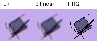

# TinySR

一个基于 PyTorch 的轻量级 2× 图像超分辨率项目。

使用简单的 CNN 对低分辨率图片进行放大和修复。目前使用的是合成图像数据集，主要用于测试模型训练和图像恢复流程。

## 效果预览



## 数据集

数据集由程序自动生成，包含训练集和验证集。

| 数据集 | 数量 |
|---|---|
| Train | 300 对 |
| Validation | 60 对 |

图片尺寸：

- LR：32×32 RGB
- HR：64×64 RGB

低分辨率图片由高清图片经过高斯模糊、下采样、添加噪声和 JPEG 压缩得到。

LR 和 HR 图片使用相同的文件名，方便配对训练。

数据集可以通过以下命令生成：

```bash
python generate_data.py
```

## 安装

安装项目依赖：

```bash
pip install -r requirements.txt
```

## 训练

先生成数据集，再运行训练脚本：

```bash
python train.py --epochs 20
```

如果使用 CPU，可以先减少训练轮数：

```bash
python train.py --epochs 3 --batch-size 16
```

训练完成后，模型权重会保存在 `checkpoints` 目录下：

- `best.pt`：验证表现最好的模型
- `last.pt`：最后一次训练保存的模型

## 推理

使用训练好的模型放大图片：

```bash
python infer.py --input data/val/lr/000000.png --checkpoint checkpoints/best.pt --output restored.png
```

输入为 32×32 图片，输出为 64×64 图片。

## 模型结构

模型采用双线性插值和 CNN 残差预测的方式进行超分辨率恢复。

首先对输入图片进行 2× 双线性插值，再使用 CNN 预测需要修正的部分，最后将两者相加得到输出。

```text
LR Image (32×32)
       |
  Bilinear ×2
       |
   CNN Layers
       |
    Residual
       |
Bilinear + Residual
       |
SR Image (64×64)
```

训练使用 L1 Loss，模型通过预测结果与 HR 图片之间的误差进行优化。

## 说明

目前模型和数据集都比较简单，主要用于学习和实验。

由于训练数据为合成图形，模型在真实动漫图片上的效果可能有限，后续可以考虑使用真实数据集或更复杂的网络结构。